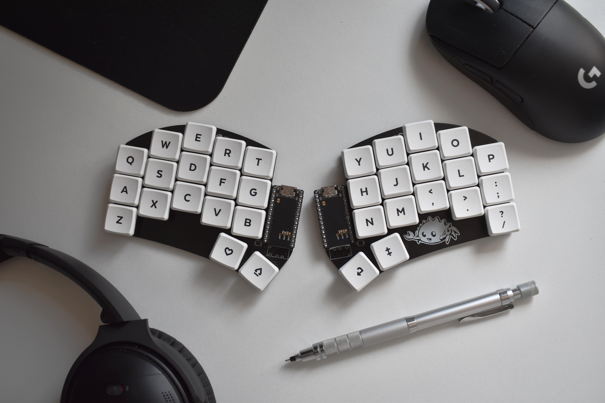
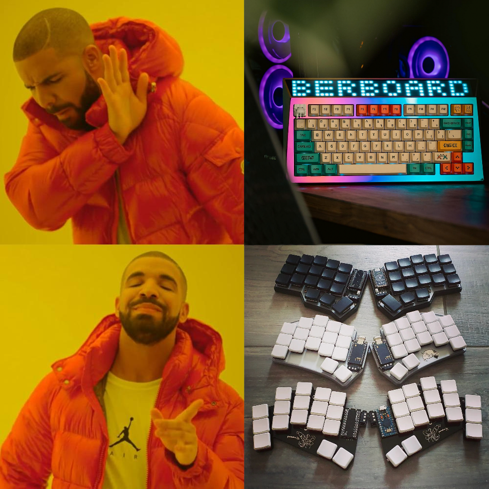
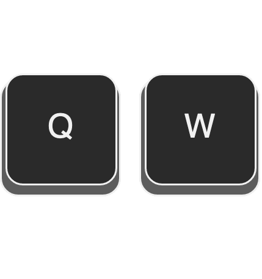
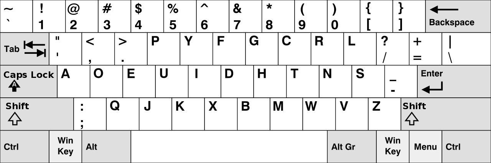
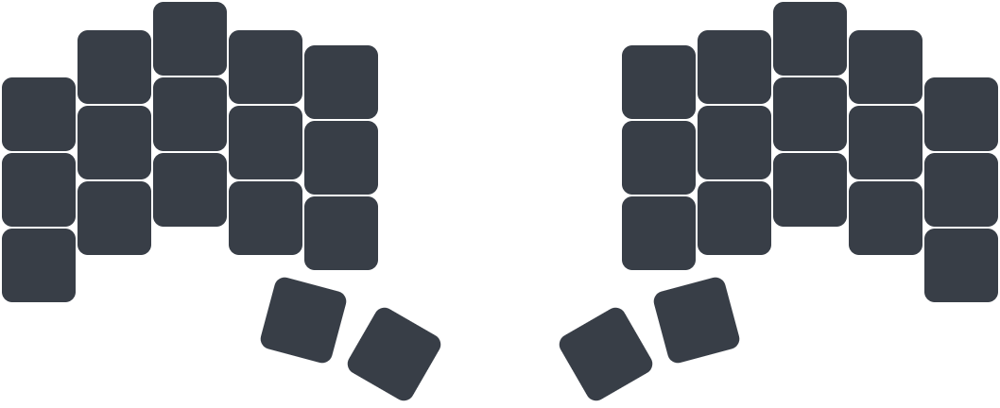
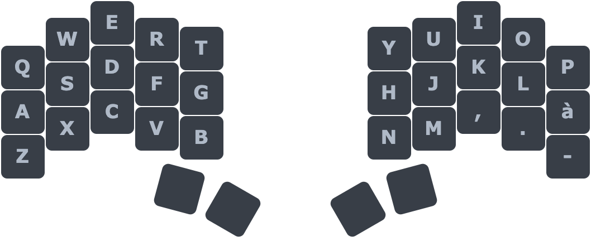

## <!--fit--> 34 keys is all you need 
_An ergonomic mechanical keyboard journey_

<!-- _footer: Author: Mattia Dal Ben -->
<!-- _paginate: false -->

---

####  Who am I?

- Master degree in EE
- Work as SWE @ Eurotech
- Mechanical keyboard enthusiast and maker
- Designed the _Redox Keyboard_ and the _Yampad_

---

### What is this talk about?

- Sub 40%
- Ergonomic
- Low profile
- Open source
- Mechanical
- Keyboards

<!--
* We're not gonna talk about your average custom mechanical keyboard
* We're gonna talk about small from factor (sub 40% i.e. 35 keys), ergonomic, low profile (choc), open-source(mostly), mechanical keyboards
* We're gonna talk about what firmware/software features/techniques make them a viable option (features that can be applied even to normal keyboards)
* ... and, above all, **why** should you want to try them.
-->

---

### Talk outline

1) _Hardware_
2) _Software_
3) _Layout_
4) _Miryoku_

<!-- 
1. _Hardware_: Advancement on keyboard physical layout.
2. _Software_: New features that make such keyboards viable
3. _Layout_: QWERTY is bad basically
4. _Miryoku_: Let's put it all together
-->

---

# <!-- fit --> 1. Hardware

---

- Top: Corona Model 4 1920 ca.
- Bottom: Macbook Air 2020 ca.

### Why are we still stuck with this s***?

<!--
On the top half you can see a Corona Model 4 that was introduced around 1920
On the bottom half a 2020 MacBook Air

There's a century between these two and they use the same keyboard...

Keyboard design essentially didn't change since 1880 when typewrites appeared. We're burdened by design choices due to mechanical/physical constraints that no longer exist. Nobody even question it...

... and this is dumb...
-->

---

# <!-- fit --> Let's try and fix that

---

# Split halves

> "Your wrist are not built to bend like that. Split the keyboard to have a more natural posture."

<!--
Ulnar deviation occurs when your wrist is bent outward in the direction of your little finger. It is among the most common and potentially damaging keyboard postures and can lead to carpal tunnel syndrome and other serious repetitive strain injuries.

Your wrist are not built to bend like that. Split the keyboard to have a more natural posture.
-->

---

<!-- _footer: Pic: Taobao Supreme (Superme) 65% Split keyboard -->

---

# Thumb cluster

> "Why is your strongest finger used to press only a key?"

<!--
Why is your strongest finger used to press only a key? This is dumb. Give it more keys!
-->

---

<!-- _footer: Pic: Dygma Raise -->

---

# Columnar stagger

> "The row staggered layout is a heritage from the old typewriters that needed such an arrangement to prevent the percussors to get stuck."

<!--
The row staggered layout is a heritage from the old typewriters that needed such an arrangement to prevent the percussors to get stuck. Such a design is not needed anymore and doesn't fit with the human hand conformation.
-->

---

<!-- _footer: Pic: Redox -->

---

# Minimalism

> "We are moving our keys to the fingers, we're not moving our fingers to the keys"

<!--
We'll talk about how we can achieve this in the following slides but let's focus on why this is something good.

- Reducing finger movement means reducing fatigue and strain on the hands
- Reducing finger movement means fewer errors: you don't need to reposition your hands and thus reduce the probability of misplacing them
- Improving typing habits: I've always used the pinkies incorrectly especially for pressing the "shift" key which made them hurt after a day of work. Reducing the number of keys means that you're constrained to use your keyboard properly.
- Portability (duh!)
- It looks *adorable*
-->

---

<!-- _footer: Pic: Corne -->

---

# Key wells and tenting

> "A moderate elevation of the thumb side of the hand dramatically reduces the pressure on the forearm muscles."

> "The concave key wells ensure the keys are reachable and mimic the curve drawn by our fingers."

<!--
Pronation in the forearm and wrist occurs when typing with your palms face down towards the worksurface. The majority of this turning involves the rotation of both forearm bones (ulna and radius).

Sustained pronation puts pressure on the forearm muscles and tissues which reduces blood circulation and can lead to fatigue and repetitive strain injuries (“RSI”). Research demonstrates that a moderate elevation of the thumb side of the hand dramatically reduces the pressure on the forearm muscles.

The concave key wells ensure the keys are reachable and mimic the curve drawn by our fingers.
-->

---

<!-- _footer: Pic: Skeletyl -->

---

# <!-- fit --> 2. Software

---

## Keyboard Firmwares

> **QMK** (Quantum Mechanical Keyboard) Firmware is an open source (GPL-2.0) community centered around developing computer input devices. The community encompasses all sorts of input devices, such as keyboards, mice, and MIDI devices."

> **ZMK** (Zephyr™ Mechanical Keyboard) Firmware is an open source (MIT) keyboard firmware built on the Zephyr™ Project Real Time Operating System (RTOS). ZMK's goal is to provide a modern, wireless, and powerful firmware free of licensing issues.

<!--
Keyboard firmware is the software running on the microcontrollers, responsible for scanning the matrix state and reporting which keys are being pressed to the OS. Sounds pretty straightforward right? Wrong.

In the keyboard enthusiast space we have mainly two projects for this:
- QMK: Quantum Mechanical Keyboard firmware. Which is a mature project with a lively ecosystem of sub-projects.
- ZMK: Zephyr Mechanical Keyboard firmware. Which is relatively new but can support bluetooth.

There are others (KMK, TMK) with their own merits but I'll discuss this right now.
-->

---

## Keyboard Firmwares

# Features

<!--
With these tools we can program much more smart behaviours in our keyboards: some of you might be familiar with the concept of macros. Maybe ramapping keys in more comfortable places (the caps lock doesn't deserve the place it has on the keyboard) without the need to configure every OS you connect to.

There are much more useful behaviours though that we'll discuss now. You should be able to find these feature in each of the previous firmwares.
-->

---

# Layers

> ... this amounts to a function key that allows for different keys, much like what you would see on a laptop or tablet keyboard. 

- QMK https://docs.qmk.fm/#/feature_layers
- ZMK https://zmk.dev/docs/behaviors/layers

---

# Hold-Tap

> The hold-tap key will output the 'hold' behavior if it's held for a while, and output the 'tap' behavior when it's tapped quickly

- QMK https://docs.qmk.fm/#/tap_hold
- ZMK https://zmk.dev/docs/behaviors/hold-tap

<!--
What if instead of reaching for the shift key we could just keep the key pressed a little bit longer? This technique is called "Autoshift" and leverages the Hold-tap behaviour as you can see here.
-->

---

# Mod-Tap

> The Mod-Tap behavior either acts as a held modifier, or as a tapped keycode.

- QMK https://docs.qmk.fm/#/mod_tap
- ZMK https://zmk.dev/docs/behaviors/mod-tap

<!--
If you think about it, it is the perfect application: modifiers keys (ctrl, alt, command) are rarely pressed by themselves. They're *modifiers* after all.
-->

---

# Home row mods

> In simple terms, hom row mods are the main modifier keys (namely Ctrl, Option/Alt, Command and Shift) on the home row of they keyboard set as Mod-taps.

- Great article: https://precondition.github.io/home-row-mods

<!--
Think about moving away from the home row as a cache miss: you incur in a higher latency when trying to write something
-->

---

# Layer-tap

> The "layer-tap" behavior enables a layer when a key is held, and outputs a keypress when the key is only tapped for a short time.

- QMK https://docs.qmk.fm/#/feature_layers?id=switching-and-toggling-layers
- ZMK https://zmk.dev/docs/behaviors/layers#layer-tap

<!--
We talked about layers, the key for switching layers is another good target for the Hold-tap behaviour. It is pretty much identical to the Modifiers in the sense that they're rarely pressed by themselves.

This creates a lot more room for placing this kind of keys on the keyboard: you don't need a dedicated key for layer switching anymore, you can place it wherever you want.
-->

---

# Combos

> Combo keys are a way to combine multiple keypresses to output a different key. For example, you can hit the Q and W keys on your keyboard to output escape.

- QMK https://github.com/qmk/qmk_firmware/blob/master/docs/feature_combo.md
- ZMK https://zmk.dev/docs/features/combos

<!--
What if, instead of needing a dedicated caps lock button, you could just press the two shift keys together?
-->

---

# More advanced features

- Leader key
- Conditional layers
- Tap dance
- Caps word
- and so on...

<!--
There's a lot more than this that you can achieve with these firmwares
-->

---

# <!-- fit --> 3. Layout

<!--
No talk about keyboards would be complete without talking about the QWERTY layout.

Unfortunately I'm not that knowledgable on alternative layout so I'll cover just the basics.
-->

---

## What's wrong with QWERTY?

["On the Prehistory of QWERTY"](https://repository.kulib.kyoto-u.ac.jp/dspace/bitstream/2433/139379/1/42_161.pdf)

<!--
What's wrong with QWERTY?

Why was it designed this way?

First let's address a common misconception: allegedly the QWERTY layout was designed to avoid common bi-grams (frequently used character couples in the language) to clash the typewriter percussors i.e. it was designed to slow down fast typist to avoid the typewriter to jam.

During the research for my talk I discovered that this fact was actually debunked by a group of Japanese researchers and that the QWERTY design stems from the use of the typewriter by telegraph operators (which were the first users of this new technology).

Frankly speaking, I don't think the explaination got better.

For instance: at the time they used to use the letter "I" to write the number "1". They decided to move it near the "8" to write the date faster (1870). Likewise they put "s", "z", "e" together because they usually got confused in the American Morse Code.

In the end we're still using a layout that was design for the needs of the 19th century, we're in the 21st now!
-->

---

# Can we do better?

### Dvorak layout

---

# Can we do better?

> We have seen that the DVORAK layout does produce better typing speed performance than the QWERTY keyboard, **but that this difference is just 4 or 5%**. When we look at the history of the typewriter we can assume that people are not willing to switch to this superior design: **the gain is too small compared to the costs of retraining**.

> The major feature of Dvorak’s DSK, however, is its optimised key placement. The DSK is designed for touch typing and **significantly reduces finger movement and thus typists’ fatigue**. Though this ergonomic feature has been pointed out in many different studies –and in fact is quite evident– this has not convinced the general public that they are better of with the DVORAK layout.

["Comparing Different Keyboard Layouts: Aspects of QWERTY, DVORAK and alphabetical keyboards"](https://www.researchgate.net/profile/Pieter-Buzing/publication/252214871_Comparing_Different_Keyboard_Layouts_Aspects_of_QWERTY_DVORAK_and_alphabetical_keyboards/links/60c3123c4585157774c7fd96/Comparing-Different-Keyboard-Layouts-Aspects-of-QWERTY-DVORAK-and-alphabetical-keyboards.pdf?origin=publication_detail)

---

### Colemak layout

> Coleman states that he designed Colemak to be easy to learn, explaining that Dvorak is hard for QWERTY typists to learn due to it being so different from the QWERTY layout.

<!--
Colemak layout tries to address the issues with the Dvorak layout, preserving its efficiency and design principles.

Unfortunately it's still considered an exotic layout and its adoption is quite small
-->

---

# <!-- fit --> 4. Miryoku

---

# Let's put it all together now

<!--
We covered all the feature and tachniques that can improve our keyboards. Let's put it all together now
-->

---

# Base layer

<!--
Let's try and fit all the keys of our normal keyboard onto our tiny board over here.
-->

---

# Base layer

<!--
Letters are where we expect them to be.
-->

---

# Base layer

<!--
We talked about the fact that we should use our thumbs more, let's assign them the most used keys: space, backspace, return, and tab.

Esc and Delete are accessible through combos: by pressing the two left thumb keys we'll get the Escape key, by doing the same on the right we get the Delete key.

Furthermore we'll need layers to fit everything into this keyboard, thumbs will be responsible for all the layer switching thanks to layer-tap we just talked about.
-->

---

# Base layer

<!--
To cover the mods we'll simply use the home-row mods we talked about in the previous slides
-->

---

# Num layer

<!--
Let's start using our layers then:

Let's start by putting the numbers on the left hand in a numpad layout so that it's easy to remember. To access symbols we can simply press shift or access a shortcut layer called Symbol layers.

Symbols are the same as reported in the num row, so nothing has changed from the normal keyboard. Nothing new to learn.
-->

---

# Fun layer

<!--
Following the same principle, let's put the function keys in the same spots as the number layer in a layer on their own. We already know where most of our keys are located.
-->

---

# Nav layer

<!--
On the right hand let's put our nav cluster and the arrow keys. If you prefer the usual inverted T layout for the arrows there's an option for that.

And just like that: all the keys from a normal keyboard are covered. But we can do much much more.
-->

---

# The Miryoku layout

Docs: https://github.com/manna-harbour/miryoku

---

# Personal experience

* It improved my typing habits
* The "limitations" of this keyboard made me discover new *improved* typing habits
* Shortcuts are *so much more comfortable to type*
* Improved symbols access
* I've yet to encounter a key combination that I cannot type
* It is **FUN**

<!--
- I've always used the pinkies incorrectly especially for pressing the "shift" key which made them hurt after a day of work. With the miryoku layout I am forced to use the index and to alternate between left and right hand (which is the correct way of doing it). I also used to press the spacebar with my index finger, these keyboard made me drop this bad habit.
- The "limitation" of they keyboard made me discover new ways of typing: I can't keep backspace pressed to delete a word if I need to because this triggers the layer, due to this I discovered (and *actually started using*) the alt/cmd+backspace combinations which improved my typing habits again. This is now ingrained in my muscle memory and use it everywhere (like the alt+cmd arrow keys).
- Due to their placement (home-row mods) shortcuts are so much easier to type (see iTerm2 tab/split change)
- Accessing symbols is much easier now since I no longer need to reposition my hands and thus I'm using Vim command that depends on these symbols (%, $, {) much more frequently.
- I've yet to encounter a key combination that I cannot type
- It is **fun**
-->

---

# Conclusions

* Minimal (sub 40 keys) ergonomic keyboards are *viable*, if not *preferable* to normal keyboards.
* The techniques developed for this keyboard to work might come useful for all keyboard users.
* Give them a try!
