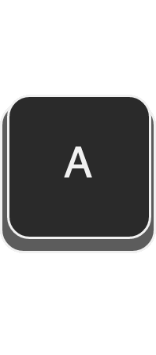
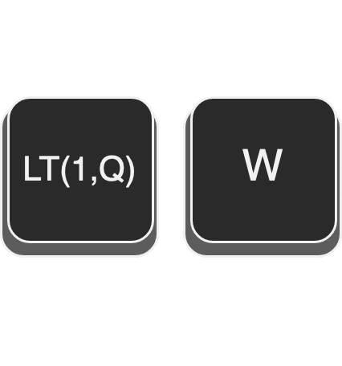
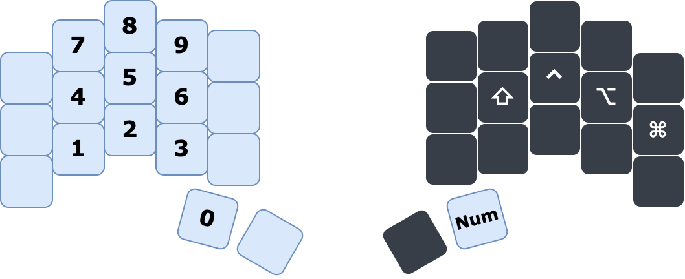
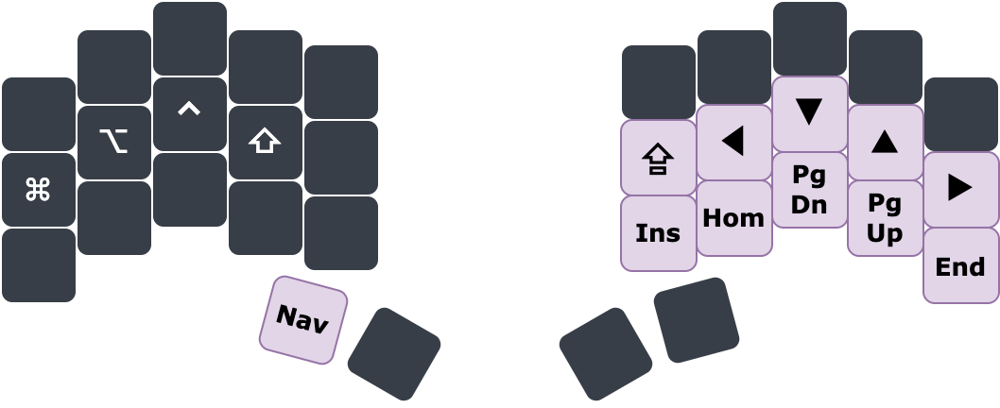

## <!--fit--> 34 keys is all you need 
_An ergonomic mechanical keyboard journey_

<!-- _footer: Author: Mattia Dal Ben -->
<!-- _paginate: false -->

---

####  Who am I?

- Master degree in EE
- Work as SWE @ Eurotech
- Mechanical keyboard enthusiast and maker
- Designed the _Redox Keyboard_ and the _Yampad_

---

### What is this talk about?

- Sub 40%
- Ergonomic
- Low profile
- Open source
- Mechanical
- Keyboards

<!--
* We're not gonna talk about your average custom mechanical keyboard
* We're gonna talk about small from factor (sub 40% i.e. 35 keys), ergonomic, low profile (choc), open-source(mostly), mechanical keyboards
* We're gonna talk about what firmware/software features/techniques make them a viable option (features that can be applied even to normal keyboards)
* ... and, above all, **why** should you want to try them.
-->

---

### Talk outline

1) _Hardware_
2) _Software_
3) _Layout_
4) _Miryoku_

<!-- 
1. _Hardware_: Advancement on keyboard physical layout.
2. _Software_: New features that make such keyboards viable
3. _Layout_: QWERTY is bad basically
4. _Miryoku_: Let's put it all together
-->

---

# <!-- fit --> 1. Hardware

---

- Top: Corona Model 4 1920 ca.
- Bottom: Macbook Air 2020 ca.

### Why are we still stuck with this s***?

<!--
On the top half you can see a Corona Model 4 that was introduced around 1920
On the bottom half a 2020 MacBook Air

There's a century between these two and they use the same keyboard...

Keyboard design essentially didn't change since 1880 when typewrites appeared. We're burdened by design choices due to mechanical/physical constraints that no longer exist. Nobody even question it...

... and this is dumb...
-->

---

# <!-- fit --> Let's try and fix that

---

# Split halves

> "Your wrist are not built to bend like that. Split the keyboard to have a more natural posture."

<!--
Ulnar deviation occurs when your wrist is bent outward in the direction of your little finger. It is among the most common and potentially damaging keyboard postures and can lead to carpal tunnel syndrome and other serious repetitive strain injuries.

Your wrist are not built to bend like that. Split the keyboard to have a more natural posture.
-->

---

---

# Thumb cluster

> "Why is your strongest finger used to press only a key?"

<!--
Why is your strongest finger used to press only a key? This is dumb. Give it more keys!
-->

---

---

# Columnar stagger

> "The row staggered layout is a heritage from the old typewriters that needed such an arrangement to prevent the percussors to get stuck."

<!--
The row staggered layout is a heritage from the old typewriters that needed such an arrangement to prevent the percussors to get stuck. Such a design is not needed anymore and doesn't fit with the human hand conformation.
-->

---

---

# Minimal

> "We are moving our keys to the fingers, we're not moving our fingers to the keys"

<!--
- Less distance between keys (minimal key travel) means fewer errors
- Less hand repositioning which means fewer errors (I found that most of my mistakes were due to repositioning my hand after moving away from the home row, these can't exists if you're always on the home row) Example of annoying movements: home row -> esc, home row -> arrow keys
- Improving typing habits: I've always used the pinkies incorrectly especially for pressing the "shift" key which made them hurt after a day of work. With the miryoku layout I am forced to use the index and to alternate between left and right hand (which is the correct way of doing it).
- The "limitation" of they keyboard made me discover new ways of typing: I can't keep backspace pressed to delete a word if I need to because this triggers the layer, due to this I discovered (and *actually started using*) the alt/cmd+backspace combinations which improved my typing habits again. This is now ingrained in my muscle memory and use it everywhere (like the alt+cmd arrow keys).
- Due to their placement (home-row mods) shortcuts are so much easier to type (see iTerm2 tab/split change)
- Portability (duh!)
- It is **fun**
-->

---

---

# Key wells and tenting

> "A moderate elevation of the thumb side of the hand dramatically reduces the pressure on the forearm muscles."

> "The concave key wells ensure the keys are reachable and mimic the curve drawn by our fingers."

<!--
Pronation in the forearm and wrist occurs when typing with your palms face down towards the worksurface. The majority of this turning involves the rotation of both forearm bones (ulna and radius).

Sustained pronation puts pressure on the forearm muscles and tissues which reduces blood circulation and can lead to fatigue and repetitive strain injuries (“RSI”). Research demonstrates that a moderate elevation of the thumb side of the hand dramatically reduces the pressure on the forearm muscles.

The concave key wells ensure the keys are reachable and mimic the curve drawn by our fingers.
-->

---

---

# <!-- fit --> 2. Software

---

## Keyboard Firmwares

> **QMK** (Quantum Mechanical Keyboard) Firmware is an open source (GPL-2.0) community centered around developing computer input devices. The community encompasses all sorts of input devices, such as keyboards, mice, and MIDI devices."

> **ZMK** (Zephyr™ Mechanical Keyboard) Firmware is an open source (MIT) keyboard firmware built on the Zephyr™ Project Real Time Operating System (RTOS). ZMK's goal is to provide a modern, wireless, and powerful firmware free of licensing issues.

<!--
Keyboard firmware is the software running on the microcontrollers, responsible for scanning the matrix state and reporting which keys are being pressed to the OS. Sounds pretty straightforward right? Wrong.

In the keyboard enthusiast space we have mainly two projects for this:
- QMK: Quantum Mechanical Keyboard firmware. Which is a mature project with a lively ecosystem of sub-projects.
- ZMK: Zephyr Mechanical Keyboard firmware. Which is relatively new but can support bluetooth.

There are others (KMK, TMK) with their own merits but I'll discuss this right now.
-->

---

## Keyboard Firmwares

# Features

<!--
With these tools we can program much more smart behaviours in our keyboards: some of you might be familiar with the concept of macros. Maybe ramapping keys in more comfortable places (the caps lock doesn't deserve the place it has on the keyboard) without the need to configure every OS you connect to.

There are much more useful behaviours though that we'll discuss now. You should be able to find these feature in each of the previous firmwares.
-->

---

# Layers

> ... this amounts to a function key that allows for different keys, much like what you would see on a laptop or tablet keyboard. 

- QMK https://docs.qmk.fm/#/feature_layers
- ZMK https://zmk.dev/docs/behaviors/layers

---

# Hold-Tap

> The hold-tap key will output the 'hold' behavior if it's held for a while, and output the 'tap' behavior when it's tapped quickly

- QMK https://docs.qmk.fm/#/tap_hold
- ZMK https://zmk.dev/docs/behaviors/hold-tap

<!--
What if instead of reaching for the shift key we could just keep the key pressed a little bit longer? This technique is called "Autoshift" and leverages the Hold-tap behaviour as you can see here.
-->

---

# Mod-Tap

> The Mod-Tap behavior either acts as a held modifier, or as a tapped keycode.

- QMK https://docs.qmk.fm/#/mod_tap
- ZMK https://zmk.dev/docs/behaviors/mod-tap

<!--
If you think about it, it is the perfect application: modifiers keys (ctrl, alt, command) are rarely pressed by themselves. They're *modifiers* after all.
-->

---

# Home row mods

> In simple terms, hom row mods are the main modifier keys (namely Ctrl, Option/Alt, Command and Shift) on the home row of they keyboard set as Mod-taps.

- Great article: https://precondition.github.io/home-row-mods

<!--
Think about moving away from the home row as a cache miss: you incur in a higher latency when trying to write something
-->

---

# Layer-tap

> The "layer-tap" behavior enables a layer when a key is held, and outputs a keypress when the key is only tapped for a short time.

- QMK https://docs.qmk.fm/#/feature_layers?id=switching-and-toggling-layers
- ZMK https://zmk.dev/docs/behaviors/layers#layer-tap

<!--
We talked about layers, the key for switching layers is another good target for the Hold-tap behaviour. It is pretty much identical to the Modifiers in the sense that they're rarely pressed by themselves.

This creates a lot more room for placing this kind of keys on the keyboard: you don't need a dedicated key for layer switching anymore, you can place it wherever you want.
-->

---

# Combos

> Combo keys are a way to combine multiple keypresses to output a different key. For example, you can hit the Q and W keys on your keyboard to output escape.

- QMK https://github.com/qmk/qmk_firmware/blob/master/docs/feature_combo.md
- ZMK https://zmk.dev/docs/features/combos

<!--
What if, instead of needing a dedicated caps lock button, you could just press the two shift keys together?
-->

---

# More advanced features

- Leader key
- Conditional layers
- Tap dance
- Caps word
- and so on...

<!--
There's a lot more than this that you can achieve with these firmwares
-->

---

# <!-- fit --> 3. Layout

---

[WIP]

---

# <!-- fit --> 4. Miryoku

---

# Let's put it all together now

<!--
We covered all the feature and tachniques that can improve our keyboards. Let's put it all together now
-->

---

# Base layer

<!--
Let's try and fit all the keys of our normal keyboard onto our tiny board over here.
-->

---

# Base layer

<!--
Let's try and fit all the keys of our normal keyboard onto our tiny board over here.
-->

---

# Base layer

---

# Base layer

---

# Num layer

---

# Fun layer

---

# Nav layer

---

# The Miryoku layout

Docs: https://github.com/manna-harbour/miryoku
